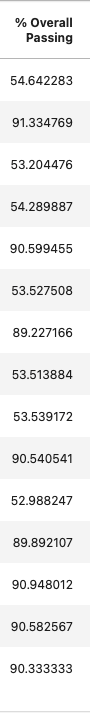
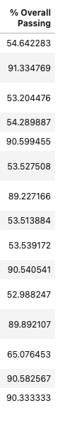
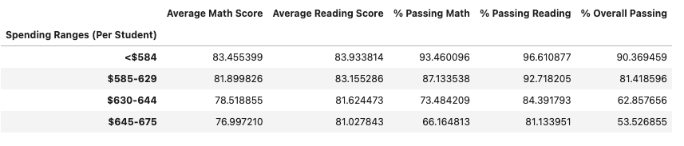
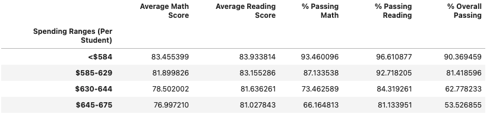

# Gleaning Insights From School Testing Results with _JupyterLab_
## Purpose of Analysis
The Vanderbilt University Data Analytics Bootcamp is a streamline of coursework that exposes students to a broad set of technical applications and data management concepts, strengthening their problem solving skills in data-driven contexts. Module 4 focuses on using Pandas in a Jupyter notebook to clean, group and analyze data from a CSV detailing results of test scores of students from several high schools.  

THe purpose of this analysis is to highlight differences in math and reading test score outcomes after the test scores of the 9th grade population at Thomas High School were removed due to accusations of cheating. 

## Results

Thomas High School's mean math (83.4% before vs. 83.4% after) and reading (83.8% before vs 83.9% after) scores showed little change after the nine grader's 461 sets of test scores were removed from analysis, but cheating allegation against 0th graders at Thomas High School had significanrt impact on high level results:

[Thomas High School Test Results Before 9th Grade Test Score Removal - Header](School_District_Analysis/Resources/THS_before_removal_header.png)

[Thomas High School Test Results Before 9th Grade Test Score Removal - Data](School_District_Analysis/Resources/THS_before_removal.png)

[Thomas High School Test Results After 9th Grade Test Score Removal - Header](School_District_Analysis/Resources/THS_after_removal_header.png)

[Thomas High School Test Results After 9th Grade Test Score Removal - Data](School_District_Analysis/Resources/THS_after_removal.png)

- Thomas High School's overall passing percentage (_passing_ designation earned if student scores >= 70 on both math and reading exams) dropped from 90.9% to 65.1%

**Rank Before Removal:**

  

[High School Overall Passing Rankings Before 9th Grade Test Score Removal - Header](School_District_Analysis/Resources/RankHeader.png)

[High School Overall Passing Rankings Before 9th Grade Test Score Removal - Data](School_District_Analysis/Resources/RankBefore_Removal.png)

**Rank After Removal**

  

[High School Overall Passing Rankings After 9th Grade Test Score Removal - Header](School_District_Analysis/Resources/RankHeader.png)

[High School Overall Passing Rankings After 9th Grade Test Score Removal - Data](School_District_Analysis/Resources/RankAfter_Removal.png)

- Thomas High School's rank in overall passing percentage dropped from the **2nd** best to **8th** best of the 15 schools in the study

The effect is less pronounced aggregate measurements, such as overall passing percentage as a funciton of spending per capita:

[High School Testing Outcomes by Spending Range Per Capita - Before Removal](School_District_Analysis/Resources/SpendingOutcomes_Before.png)

 

[High School Testing Outcomes by Spending Range Per Capita - After Removal](School_District_Analysis/Resources/RankAfter_Removal.png)

- Despite the removal of the test scores from Thomas High School, the $630 - $644 Per Capita Spending Range Retained a 63% overall passing rate
- The removal of test scores also had little impact on the overall efficacy of medium-sized schools like Thomas High School, as schools in that range (which had 1000 - 2000 student populations) retained an approximate 91% passing rate
- The aggregate of Charter Schools in the study was also little affected by the removal of the test scores, as it retained an approximate 90% passing rate (compared to 54% for District Schools)

## Summary

Removing the 461 sets of test scores belonging to the the 9th grade population of Thomas High School dramatically impacted the school's rank amongst its peers and its overall passing rate.  

However, the scandal did not generate significant impact on the success of charter schools or mid-sized high schools, even though was Thomas High School's populace are part of those greater samples.  The removal of the ninth grader's test scores most greatly affected Thomas High School, which witnessed roughly a quarter of verifiable records dissapear, bubt it had little impact on the trends of the greater population of 39,170 pupils in the study,, namely success as a result of school type and/or size.